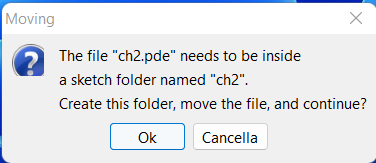
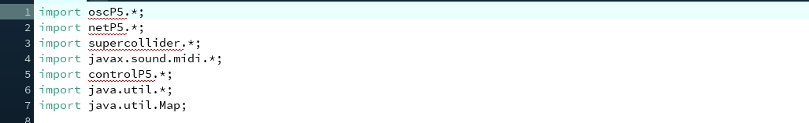
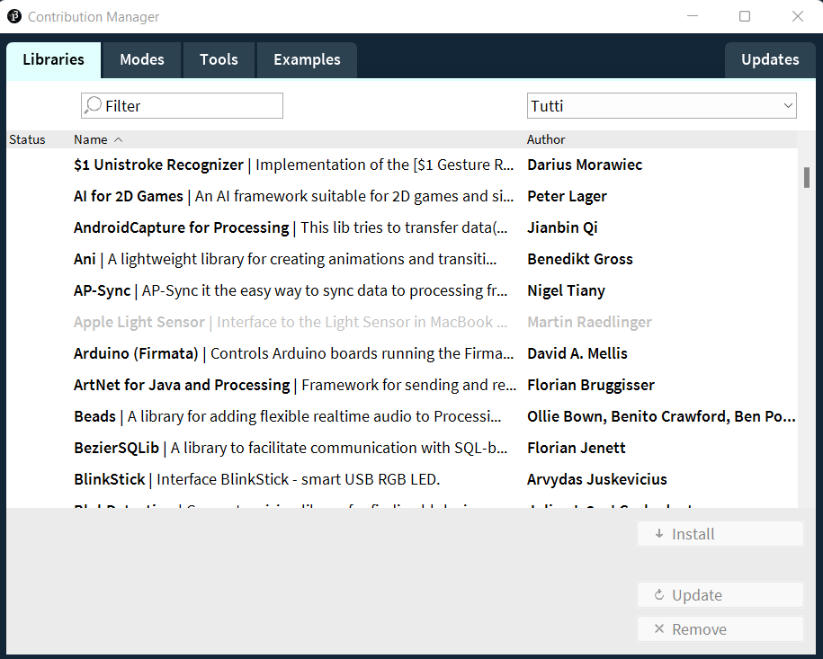
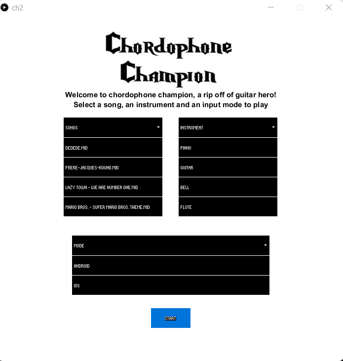
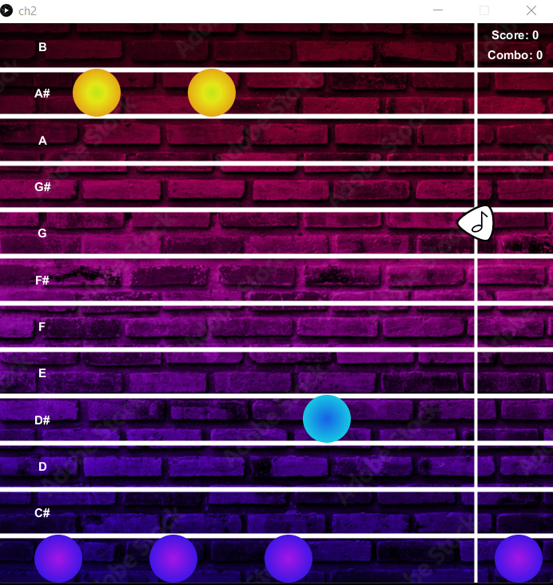

<!-- PROJECT SHIELDS -->
[![Contributors][contributors-shield]][contributors-url]
[![Forks][forks-shield]][forks-url]
[![Stargazers][stars-shield]][stars-url]

<!-- PROJECT LOGO -->
 

  

<h3 align="center">Chordophone Champion</h3>

  

   A complete computer music system with interaction design principles.
     
    <a href=""><strong>Explore the docs»</strong></a>
     
  

<!-- TABLE OF CONTENTS -->

  
Table of Contents

  <ol>
    <li>
      <a href="#about-the-project">About The Project</a>
      <ul>
        <li><a href="#built-with">Built With</a></li>
      </ul>
    </li>
    <li>
      <a href="#getting-started">Getting Started</a>
      <ul>
        <li><a href="#prerequisites">Prerequisites</a></li>
        <li><a href="#installation">Installation</a></li>
        <li><a href="#run">Run the Code</a></li>
        <li><a href="#MultisenseOSC Settings">MultisenseOSC Settings</a></li>
      </ul>
    </li>
    <li><a href="#usage">Usage</a></li>
    <li><a href="#roadmap">Roadmap</a></li>
    <li><a href="#contact">Contact</a></li>

  </ol>

<!-- ABOUT THE PROJECT -->
## About The Project

(<a href="#top">back to top</a>)

### Built With

* [Supercollider](https://supercollider.github.io/)
* [Processing](https://processing.org/)

(<a href="#top">back to top</a>)

<!-- GETTING STARTED -->
## Getting Started

### Prerequisites
You have to download Supercollider and Processing on our PC.
Don't foget also to download the MultiSense OSC application on your smartphone.
### Installation

1. Download for free Supercollider at [https://supercollider.github.io] on your PC
2. Install Supercollider on your PC
3. Download for free Processing at [https://processing.org/download] on your PC
4. Install Processing on your PC
5. Download and install for free MultiSense OSC on your smartphone (Google Play Store link: [https://play.google.com/store/apps/details?id=edu.polytechnique.multisense.release])

### Run
1. Open instruments.sc file with Supercollider and run it
2. Open the ch2.pde file with Processing
3. Accept the following alert that you get after opening the file  
4. In order to solve the error you will find in the import you have to do the next step  
5. Go to Sketch > Import Library > Add Library... It will open the Contribution Manager panel:  here search and find the missing libraries and then click the install button
6. Move the data folder inside the ch2 folder
7. Finally click the play button on top for run the code

### MultisenseOSC Settings
1. Open the MultisenseOSC application on your smartphone
2. Insert the IP address of your PC and the port number '12000'; then click NEXT button
3. Enable the Orientation in tha main menu of the app
4. Click on the Orientation card in order to expand it
5. Take the smartphone straight in front of the PC and then click OFFSET button
6. Start the OSC clicking the start button on top

(<a href="#top">back to top</a>)

<!-- USAGE EXAMPLES -->
## Usage

(<a href="#top">back to top</a>)

<!-- ROADMAP -->
## Roadmap

- [✓] customizable FM synth
- [✓] you can save and load patterns
- [✓] you can use the FM synth as an instrument with a MIDI external device
- [✓] you can play our demo
- [✓] you can choose between a sinusoidal wave, a square wave or a sawtooth wave as carrier
- [✓] you can choose the synthesis parameters (ratio and index)
- [✓] you can setup the envelope (attack and release)
- [✓] you can set the panning
- [✓] you can view the time and frequency scope directly in the main window

(<a href="#top">back to top</a>)

<!-- CONTACT -->
## Contact

Gerardo Cicalese - (gerardo.cicalese@mail.polimi.it) 

Alberto Bollino - (alberto.bollino@mail.polimi.it) 

Umberto Derme - (umberto.derme@mail.polimi.it) 

Giorgio Granello - (giorgio.granello@mail.polimi.it) 

Project Link: [https://github.com/polimi-cmls-22/group7-HW-SC-Radical_Geeks](https://github.com/polimi-cmls-22/group7-HW-SC-Radical_Geeks)

(<a href="#top">back to top</a>)

<!-- MARKDOWN LINKS & IMAGES -->
<!-- https://www.markdownguide.org/basic-syntax/#reference-style-links -->
[contributors-shield]: https://img.shields.io/github/contributors/polimi-cmls-22/group7-hw-SC-Radical_Geeks.svg?style=for-the-badge
[contributors-url]: https://github.com/polimi-cmls-22/group7-hw-SC-Radical_Geeks/graphs/contributors
[forks-shield]: https://img.shields.io/github/forks/polimi-cmls-22/group7-hw-SC-Radical_Geeks.svg?style=for-the-badge
[forks-url]: https://github.com/polimi-cmls-22/group7-hw-SC-Radical_Geeks/network/members
[stars-shield]: https://img.shields.io/github/stars/polimi-cmls-22/group7-hw-SC-Radical_Geeks.svg?style=for-the-badge
[stars-url]: https://github.com/polimi-cmls-22/group7-hw-SC-Radical_Geeks/stargazers
